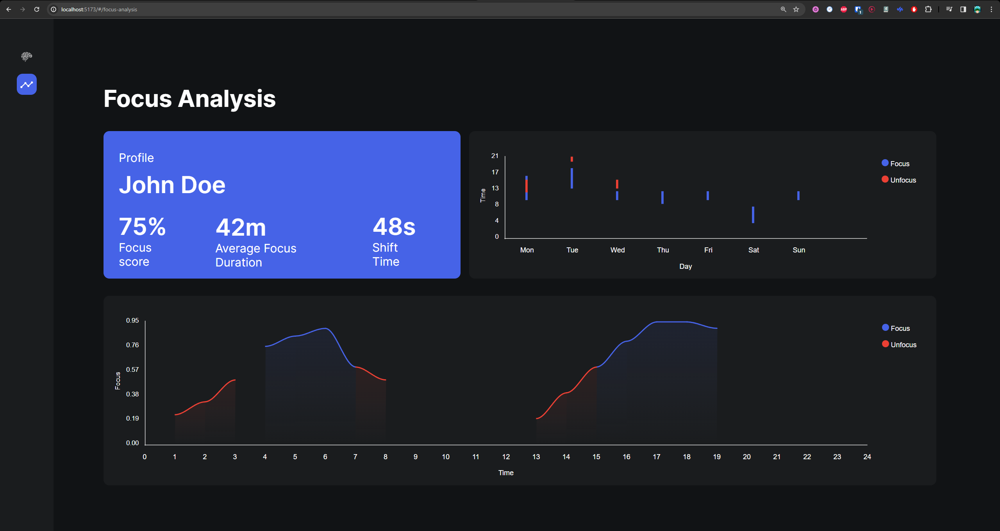

# Focus Classifier Demo

This project seeks to manipulate brain data using OpenBCIs backend (for now) and use the focus classification algorithm to deliver insightful learning metrics back to the user within an intuitive interface. 
We are working on tweaking the Focus algorithm itself to provide more accurate results since OpenBCI have scrapped the Python-powered Focus widget a few years ago. 

---
### Here is the focus report page to give an idea of what we're working towards.

---

## Behind the Scenes
We are currently using OpenBCIs Python [BrainFlow](https://brainflow.readthedocs.io/en/stable/) libraries to power the backend and handle the data processing.
For the front-end, we are using VueJS with Vite.
